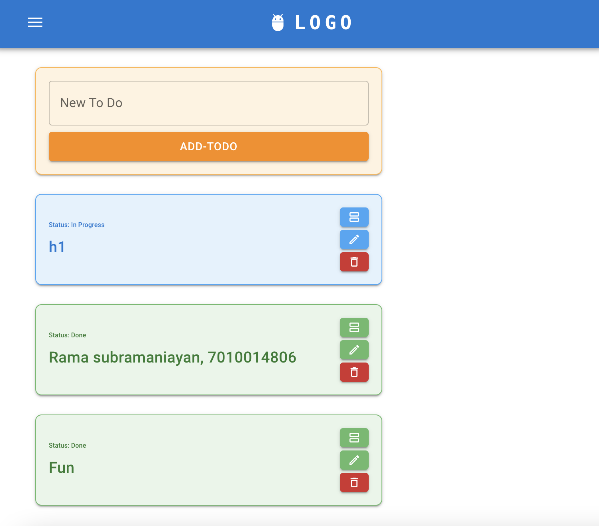
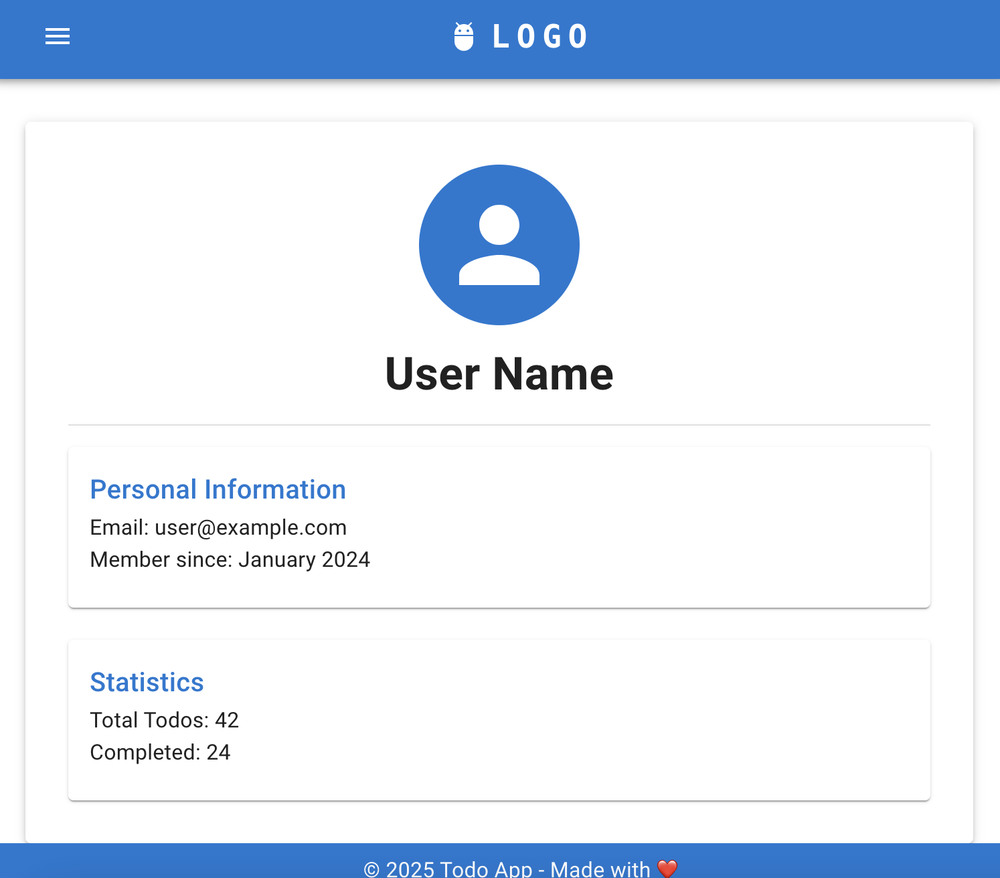
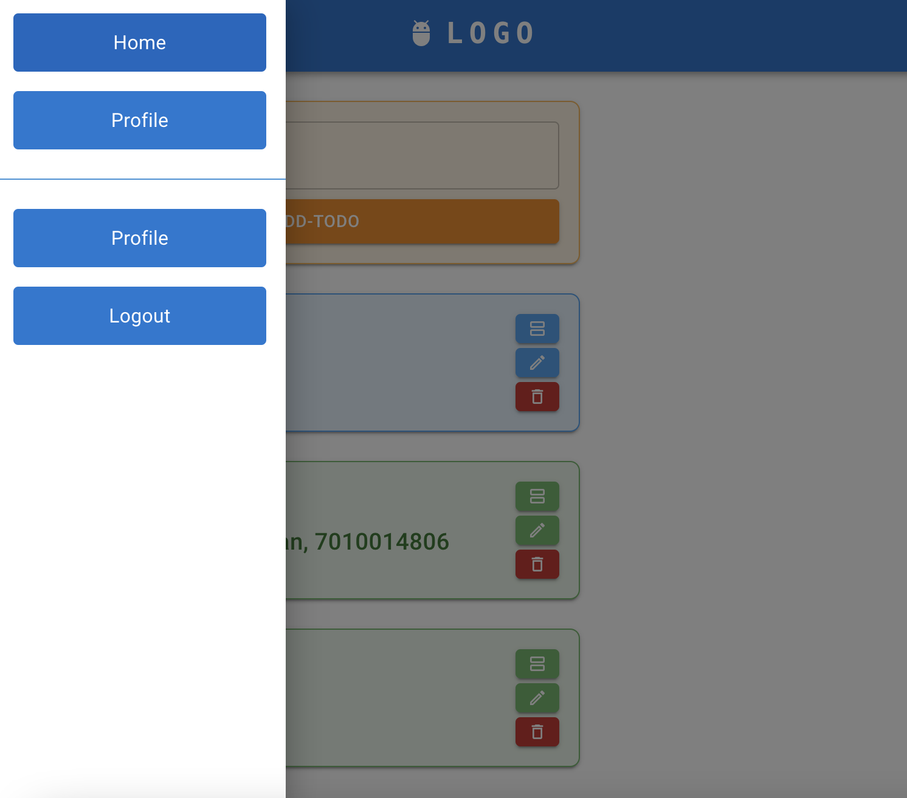

# React Firebase Todo App

A modern, responsive Todo application built with React, TypeScript, Material-UI, and Firebase.

## Features

- 🔐 User authentication with Firebase
- 📝 Create, read, update, and delete todo items
- 🔄 Real-time updates with Firestore
- 📱 Responsive design works on all devices
- 🎨 Beautiful Material-UI components with custom theming

## App Screenshots

<div align="center" style="display: flex; flex-direction: row; justify-content: center; gap: 20px;">
  <div style="text-align: center; max-width: 30%;">
    
    <p><em>Main Todo Screen</em></p>
  </div>
  <div style="text-align: center; max-width: 30%;">
    
    <p><em>User Profile</em></p>
  </div>
  <div style="text-align: center; max-width: 30%;">
    
    <p><em>Settings Screen</em></p>
  </div>
</div>

## Technology Stack

- **Frontend**: React, TypeScript, Material-UI
- **Backend**: Firebase (Authentication, Firestore)
- **Routing**: React Router
- **State Management**: React Hooks

## Getting Started

### Prerequisites

- Node.js (v14.x or higher)
- npm or yarn
- Firebase account

### Installation

1. Clone the repository:
   ```bash
   git clone https://github.com/yourusername/react-firebase-todo.git
   cd react-firebase-todo
   ```

2. Install dependencies:
   ```bash
   npm install
   # or
   yarn install
   ```

3. Create a `.env` file in the root directory with your Firebase configuration:
   ```
   REACT_APP_FIREBASE_API_KEY=your-api-key
   REACT_APP_FIREBASE_AUTH_DOMAIN=your-auth-domain
   REACT_APP_FIREBASE_PROJECT_ID=your-project-id
   REACT_APP_FIREBASE_STORAGE_BUCKET=your-storage-bucket
   REACT_APP_FIREBASE_MESSAGING_SENDER_ID=your-messaging-sender-id
   REACT_APP_FIREBASE_APP_ID=your-app-id
   REACT_APP_MEASUREMENT_ID=your-measurement-id
   ```

4. Start the development server:
   ```bash
   npm start
   # or
   yarn start
   ```

## Firebase Setup

1. Create a new Firebase project at [Firebase Console](https://console.firebase.google.com/)
2. Enable Authentication (Email/Password)
3. Create a Firestore database
4. Set up security rules for your Firestore database:
   ```
   rules_version = '2';
   service cloud.firestore {
     match /databases/{database}/documents {
       match /todos/{document=**} {
         allow read, write: if request.auth != null;
       }
       match /users/{userId} {
         allow read, write: if request.auth != null && request.auth.uid == userId;
       }
     }
   }
   ```

## Project Structure

```
src/
├── components/       # Reusable UI components
│   ├── auth/         # Authentication related components
│   └── utils/        # Utility components
├── config/           # Configuration files
├── pages/            # Page components
├── routes/           # Routing configuration
├── App.tsx           # Main application component
└── index.tsx         # Entry point
```

## Deployment

To deploy to Firebase Hosting:

1. Install Firebase CLI:
   ```bash
   npm install -g firebase-tools
   ```

2. Login to Firebase:
   ```bash
   firebase login
   ```

3. Initialize Firebase:
   ```bash
   firebase init
   ```

4. Build the project:
   ```bash
   npm run build
   # or
   yarn build
   ```

5. Deploy to Firebase:
   ```bash
   firebase deploy
   ```

## Security Considerations

- Never commit your `.env` file or Firebase configuration directly to version control
- Implement proper authentication checks in your application
- Set up appropriate Firestore security rules

## License

MIT

## Acknowledgements

- [React](https://reactjs.org/)
- [Firebase](https://firebase.google.com/)
- [Material-UI](https://mui.com/)
- [React Router](https://reactrouter.com/)
